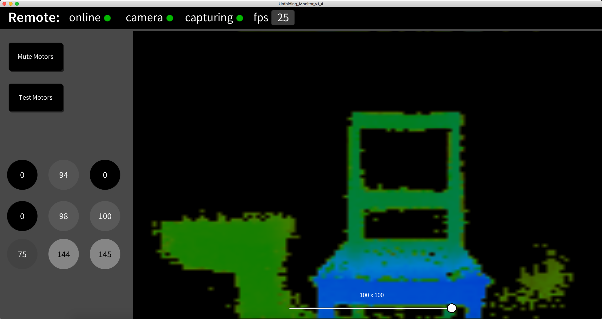
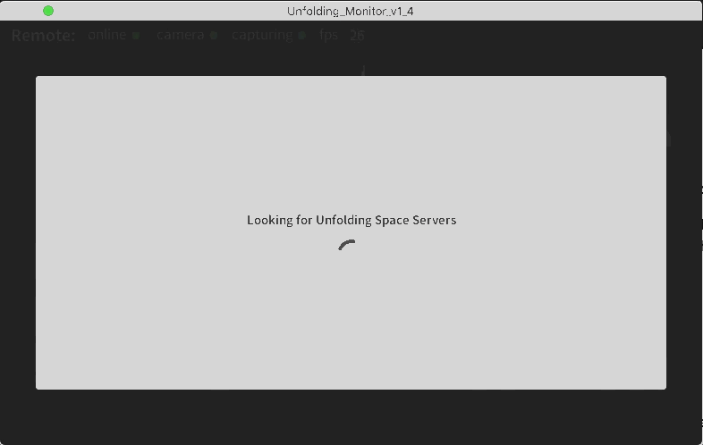
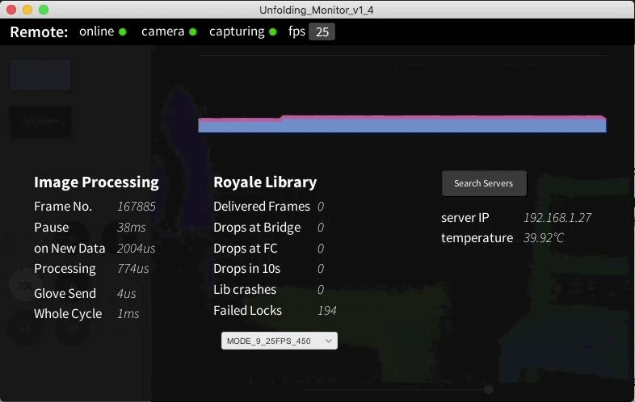
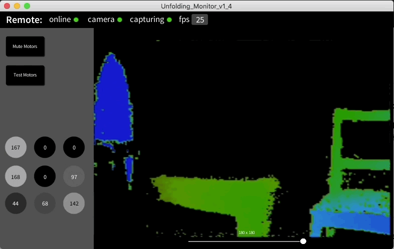
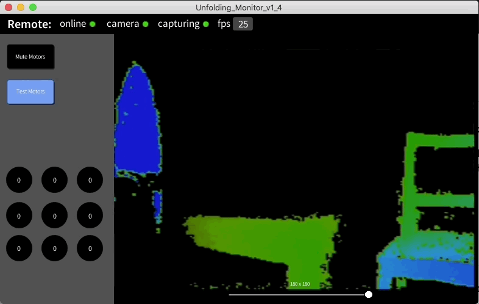

# Unfolding Space Monitor

This repo contains the monitor-app for the “Unfolding Space” glove – a prototypical open source navigation aid system for the visually impaired. Please check out the main repository of the [Unfolding Space](https://www.github.com/jakobkilian/unfolding-space) project for more information and a list of related repos and content.

## About the Unity Project

The monitor-app is done in Unity 3D (version 2020.3.25f1 LTS) project. It therefore runs on all systems supported by Unity. There are builds for Mac OS X, Windows and Android in the [build](build) folder. 

The app is working quite fast and reliable but is – in very large parts – still in a draft state. So don't expect to much. The app is responsive to some degree but should always be used in landscape. 

I deleted the Source Sans TTF files due to unknown license situation. You have to add them manually to the `Assets/Fonts` folder. 

## Install

Just go to the latest release, download the attached build for your system and run.

## Usage

Your device needs to be in a network that allows udp protocol. If there is an Unfolding Space Glove in the same network, the app will spot it and offer you a dropdown to aquire a connection to it. 

When you click/tap on the top bar, another menu will open up with more background information and a plot of the time that the glove needed for the processing of one frame. Here you can also go back to the selection menu:

### Mute Motors

You can stop all motors by clicking on *Mute Motors*. When the glove is held in a way that it turns off the motors itself (e.g. if you let the arm hang down it turns off), the mute botton will light up as well.

### Test Motors

By clicking on *Test Mode* you can test the function of motors by clicking on them: 

## Credits

Thanks to NeuralDip for [Simplest Plot](https://github.com/NeuralDip/SimplestPlot)

And thanks to Unity for their software and content

